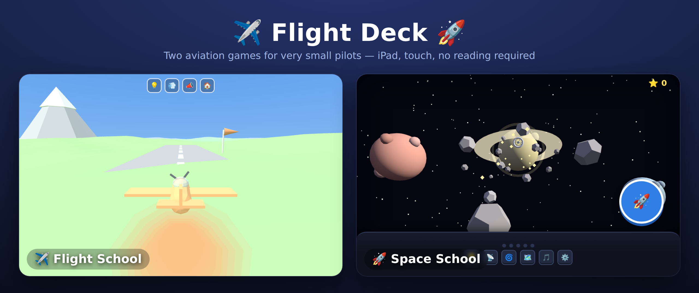
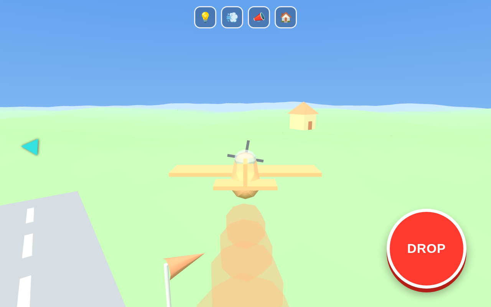
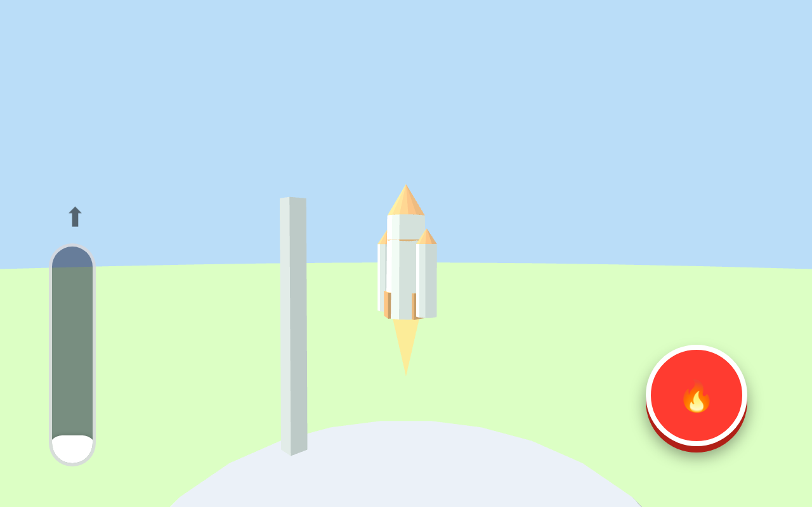
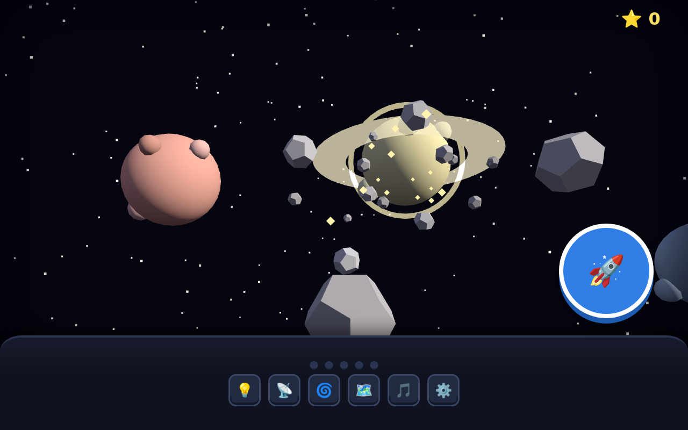
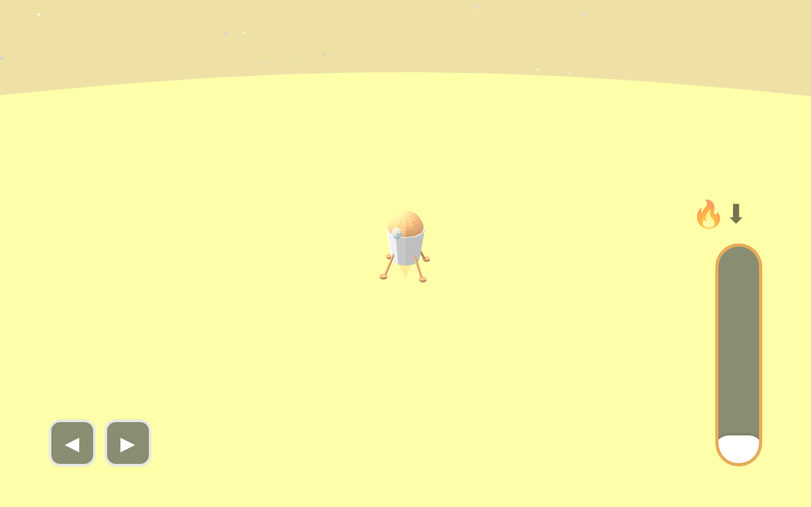
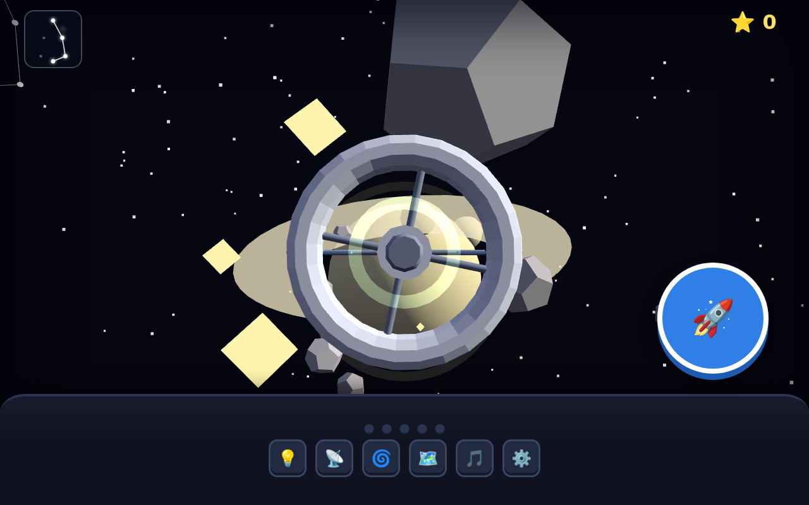
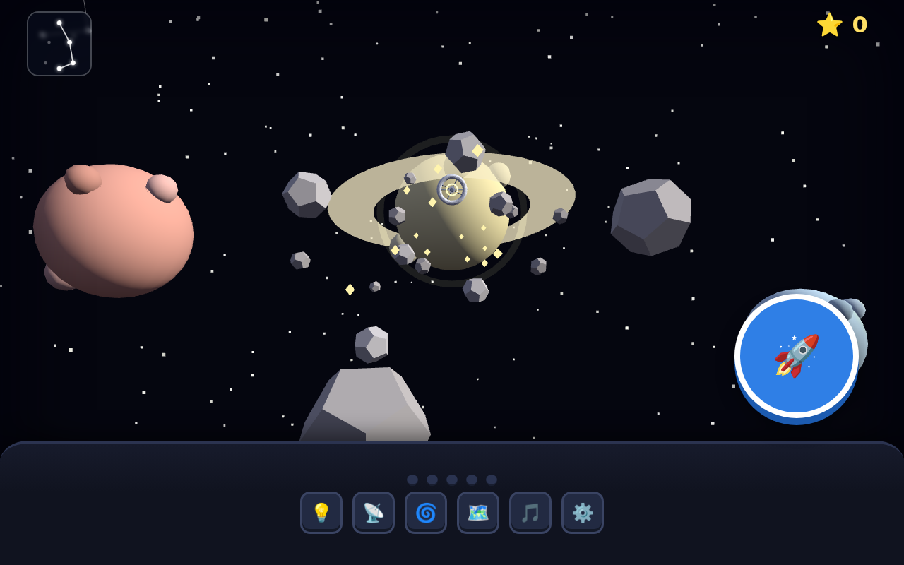

# ✈️ Flight Deck 🚀 — aviation games for little pilots



A small collection of aviation-themed games built for two young children (target:
a competent 5-year-old, younger sibling supervised). **iPad, touch, landscape.**
Each game is **one self-contained HTML file** — Three.js is inlined, no CDN, no
network needed at play time.

Both games share the same non-negotiables: **no crashes, no game-over, no score,
no timer, no reading required.** Icons, colour, size, sound and motion carry all
meaning — every screen survives with the text removed. And each teaches one
wordless, physical intuition the child leaves with but never hears named.

| | |
|---|---|
| **✈️ Flight School** | Fly cargo creatures to Grandma's, the mountain, the island, and airdrop them. *Hidden lesson: pulling up costs you speed.* |
| **🚀 Space School** | Launch a rocket, fly a cockpit through space, and land a buddy on a planet. *Hidden lesson: your engine is the only thing that changes your motion.* |

---

## ✈️ Flight School



Pick a pilot, load a creature (a big dragon is genuinely heavier to fly than a
little lizard), choose a destination, and fly there with a floating thumb-stick.
Press the giant **DROP** button overhead and the creature parachutes down, thumps,
stands up and waves — and **stays there forever.** Fly over the mountain next
Saturday and there's the dragon you airdropped, still waving.

- No crashes: touching the ground is a comedy *boing* and an instant respawn.
- The plane rights itself when you let go of the stick, and can't loop or fly
  inverted — it's built so a 5-year-old is never lost.
- Pull up too hard and the plane runs out of speed, gets "sleepy" (a whoop, the
  nose drops, it wakes up on its own), and speeds back up in a dive. That *is*
  the energy lesson — felt, never explained.
- **Rescue missions:** tap the 🆘 card instead of a buddy to fly out empty, swoop
  low and slow over a stranded buddy to scoop it up, and bring it home — it
  moves into a little colony beside the runway that grows over time.
- A **living world** below: hot-air balloons bob along (honk and they wobble),
  birds wheel through the sky, a **goose flock scatters** when you buzz it, and a
  sailboat bobs on a pond.
- **Day and night:** flights alternate between day and a starry night. At night
  the runway edge-lights glow and the **💡 landing light** casts a real cone to
  find your way home by — the toy switch becomes an instrument. (`CONFIG.dayNight`
  pins it to `day`/`night`/`dusk` if you like.)
- **Manual throttle (a reward, off by default):** when a kid is ready, flip
  `CONFIG.manualThrottle` (or just add `?throttle=1` to the URL) and a green
  power lever appears — pull it back to slow down and descend, push it up to
  climb. It's still capped, so pulling up too hard *always* runs you out of
  speed, and idle can never strand the plane on the runway.
- **Mission patches:** a 🏅 badge on the hangar opens a trophy wall. Do a thing
  once — a bullseye drop, a rescue, a night flight, a runway landing, haul the
  heaviest buddy — and its patch lights up; the rest sit greyed out until earned.
  A wordless "look what I've done," per pilot.
- **Two aircraft:** a ✈️/🛩️ picker in the hangar. The **seaplane** rides on
  floats and comes home to the **lake** beside the runway for a splashdown — the
  home beacon points you at the water, and setting it down earns a 🌊 patch.

## 🚀 Space School

Three stages, one journey: **launch → space → land.**

<p>



</p>

1. **Launch** — press 🚀 for the countdown, then shove the throttle up to beat
   gravity (a timid push just rumbles on the pad). The rocket fills the screen,
   and a **tilt control** lets you keep it climbing straight — hold the 🚀 in the
   green zone and it climbs faster; let the wind lean it and you just dawdle (you
   never fall). Watch the boosters separate and the sky fade to stars.
2. **Space** — a first-person **Apollo-style cockpit**: a metal panel with round
   gauges, a green **DSKY speed readout**, and flip-for-fun **switches** (lights,
   comms, warp, music…). You fly it like a real spacecraft: the **left pad slides
   you up/down/left/right**, the **right pair pushes fore/aft** (blue 🚀 in, red 🛑
   to slow). First goal: **dock with the space station** — line the station up in
   the **alignment reticle** (it locks green) and ease in while the ring + DSKY
   glow green (too fast and you boing right off). Clunk, cheer, push-off — then
   follow the beacon to your planet, scooping **stars** and bonking harmlessly off
   asteroids on the way.
   Every star you scoop lights up a **constellation** in the sky (watch the
   little chart, top-left) — finish one and it glows gold up there forever.
3. **Land** — a clear cockpit: the **altitude gauge** (left) shows how high you
   are and turns amber→red if you're falling too fast, the **◀ ▶ steer buttons**
   walk you left/right to line the 🛸 up over the **pad** (top strip glows green
   when you're over it), and the **🔥 retro lever** (right) slows your fall.
   Feather it onto the pad for confetti (any landing is a happy one). Your buddy
   hops out and lives on that planet forever, visible from orbit on your next trip.

<p>


</p>

Same pilots and buddies as Flight School — and a heavier buddy makes a heavier
rocket and a trickier landing, the same load-planning lesson carried across. It
shares the **🏅 mission-patch** trophy wall too: launching, docking, finishing a
constellation, landing on each world, and a feather-soft touchdown all earn one.

---

## Quick start

```bash
node build.js                # -> dist/flightschool.html, dist/spaceschool.html,
                             #    dist/index.html (launcher), index.html (Pages entry)
node test/physics-sim.js     # Flight School flight-model acceptance test
node test/space-sim.js       # Space School launch / coast / landing test
```

There are **no dependencies to install** — `build.js` and the physics tests are
plain Node, and Three.js is vendored in `src/vendor/three.min.js`. Open
`dist/index.html` (the launcher) or either game's HTML directly.

The end-to-end tests (`test/e2e-*.js`) additionally drive the built games in a
browser; those need Playwright (`npm i playwright`) and a Chromium binary — see
the top of each file.

---

## Getting it onto the iPad

Persistence (the worlds each child builds, one delivery at a time) uses
`localStorage`, which needs a real web origin. **Host the repo** (GitHub Pages is
set up — the site root redirects to the launcher) and open it in Safari. Then:

1. Open the launcher URL in Safari.
2. **Share → Add to Home Screen**, and launch from the home-screen icon so it
   runs fullscreen without the Safari address bar.
3. Turn the iPad **landscape** (portrait shows a "turn me sideways" screen).
4. **Guided Access** (triple-click the side button) locks the child into the app
   and disables the home-swipe — the real fix for accidental exits.

`file://` (opening from the Files app) plays fine, but Safari blocks
`localStorage` on `file://`, so deliveries won't persist between sessions (the
game falls back to in-memory state so it still runs).

---

## How to play (hand it to the kid, say nothing)

**Flight School:** tap a pilot → pick a buddy (bigger = heavier) → pick where to
go → the plane **rolls down the runway** (pull the stick up when the arrow
bounces — that's your takeoff!) → left thumb steers, big red **DROP** airdrops
the buddy over the target → follow the **gold beacon** home and set it down
gently. Land on the runway for confetti; any grass will do too.

**Space School:** tap a pilot → pick a buddy → pick a planet → press 🚀 for the
**countdown** (5-4-3-2-1!) → fly the climb with the **throttle**, keeping the
rocket straight with the **tilt** buttons → in space, **slide** (left pad) and
push **fore/aft** (right) to line up in the reticle and **dock**, then on to the
planet → **steer to the pad and retro-burn** down to land softly. The buddy stays.

---

## For grown-ups: editing the games

Everything you'd want to change lives in the **CONFIG block at the top of
`src/game.js`** (Flight School) and **`src/spacegame.js`** (Space School) — then
re-run `node build.js`:

- **Destinations** — name them after real people and places (Grandma's house,
  the real mountain). Set label, colour, position.
- **Pilots** — your kids. Identity is the icon + colour; the tail number paints
  itself from their initials. `invertPitch: true` if your child expects "pull
  back to climb".
- **Buddies** — the cargo. `mass` (0.15–0.8) is the one that matters: it makes
  the plane/rocket sluggish and the landing trickier.
- **Shared family world** — `CONFIG.familyWorld` (or `?family=1`), off by
  default. Turn it on and every pilot sees *all* pilots' delivered buddies in one
  world (on the ground in Flight School, in orbit in Space School). Charming, and
  a plausible source of tears — your call.

The flight numbers live in `src/aero.js` and `src/space.js` with comments
explaining every tuning choice — and they're *proven*, not guessed (see below).

---

## Project layout

```
src/
  aero.js         Flight School flight numbers + the energy equation (tested)
  space.js        Space School launch/space/landing numbers (tested)
  game.js         Flight School — CONFIG / PERSIST / AUDIO / WORLD / CREATURES / PLANE / UI / MAIN
  spacegame.js    Space School — CONFIG / PERSIST / AUDIO / BUILDERS / STAGES / UI / MAIN
  shell.html      Flight School HTML shell + CSS + iOS meta
  spaceshell.html Space School HTML shell + CSS + iOS meta
  vendor/three.min.js   Three.js r150 (UMD), vendored — inlined at build time
build.js          zero-dep build: src/ -> dist/*.html + launcher + Pages entry
test/
  physics-sim.js        Flight School flight-model acceptance
  space-sim.js          Space School flight-model acceptance
  e2e-verify.js         Flight School full-flow browser test (Playwright)
  e2e-space-verify.js   Space School full-flow browser test (Playwright)
dist/
  index.html            the launcher / dashboard (lists both games)
  flightschool.html     shippable single file
  spaceschool.html      shippable single file
index.html        GitHub Pages root -> redirects to dist/index.html
CLAUDE.md         Flight School design contract
SPACE_SCHOOL.md   Space School design contract
```

## Verifying a change

- `node test/physics-sim.js` / `node test/space-sim.js` — the flight-model
  acceptance tests. If you retune the numbers, these tell you whether the lesson
  survived (Flight School: a sustained pull still stalls; Space School: a timid
  throttle can't lift, a retro-burn still lands soft).
- The `test/e2e-*.js` scripts walk each built game end-to-end in a browser.
- **The real acceptance test:** hand it to the five-year-old with no explanation.
  They should be flying — and delivering — within a minute, and asking for it
  again the next day.

## Roadmap (v2)

- ✅ **Manual throttle** for Flight School when a kid is ready
  (`CONFIG.manualThrottle` / `?throttle=1`).
- **Forged creatures** — swap the procedural buddies for meshes the kids design
  and 3D-print; `mass` flows straight into the flight model.
- Wire a couple of Space School's toy switches to visible effects; tune trip
  length / add a manual "descend now" control.
